##############################################################################
Chapter Button & LED
##############################################################################

Usually, there are three essential parts in a complete automatic control device: INPUT, OUTPUT, and CONTROL. In last section, the LED module was the output part and ESP32 was the control part. In practical applications, we not only make LEDs flash, but also make a device sense the surrounding environment, receive instructions and then take the appropriate action such as LEDs light up, make a buzzer turn ON and so on.

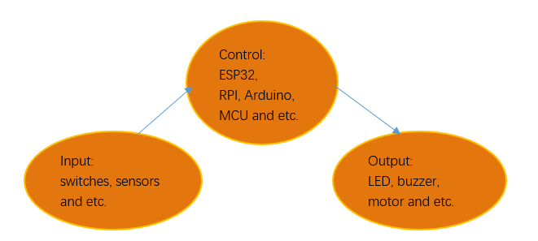

Next, we will build a simple control system to control an LED through a push button switch.

Project Button & LED
*****************************************

In the project, we will control the LED state through a Push Button Switch. When the button is pressed, our LED will turn ON, and when it is released, the LED will turn OFF. This describes a Momentary Switch.

Component List
========================================

+------------------------------------+-------------------------+
| ESP32-WROVER x1                    | GPIO Extension Board x1 |
|                                    |                         |
| |Chapter01_00|                     | |Chapter01_01|          |
+------------------------------------+-------------------------+
| Breadboard x1                                                |
|                                                              |
| |Chapter01_02|                                               |
+-----------------+------------------+-------------------------+
| LED x1          | Resistor 220Ω x1 | Push button x1          |
|                 |                  |                         |
| |Chapter01_03|  | |Chapter01_04|   | |Chapter02_02|          |
+-----------------+------------+-----+-------------------------+
| Resistor 10kΩ x2             | Jumper M/M x4                 |
|                              |                               |
|  |Chapter02_01|              |  |Chapter01_05|               |
+------------------------------+-------------------------------+

.. |Chapter01_00| image:: ../_static/imgs/1_LED/Chapter01_00.png
.. |Chapter01_01| image:: ../_static/imgs/1_LED/Chapter01_01.png
.. |Chapter01_02| image:: ../_static/imgs/1_LED/Chapter01_02.png
.. |Chapter01_03| image:: ../_static/imgs/1_LED/Chapter01_03.png
.. |Chapter01_04| image:: ../_static/imgs/1_LED/Chapter01_04.png
.. |Chapter01_05| image:: ../_static/imgs/1_LED/Chapter01_05.png
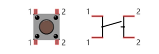
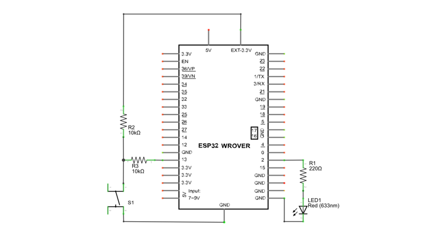

Component knowledge
=============================

Push button
-----------------------------

This type of Push Button Switch has 4 pins (2 Pole Switch). Two pins on the left are connected, and both left and right sides are the same per the illustration:

When the button on the switch is pressed, the circuit is completed (your project is Powered ON).

Circuit
==============================

.. list-table:: 
   :width: 100%
   :header-rows: 1 
   :align: center
   
   * -  Schematic diagram
   * -  |Chapter02_02|
   
   * -  Hardware connection. 
     
        :red:`If you need any support, please contact us via:` support@freenove.com

        |Chapter02_03|

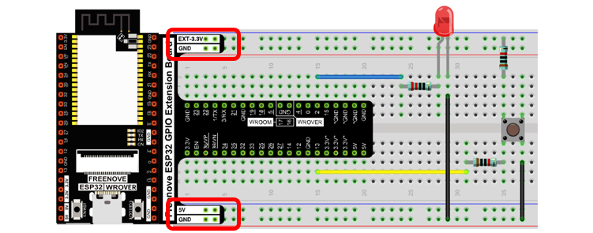

Code
======================================

This project is designed to learn to control an LED with a push button switch. First, we need to read the state of the switch and then decide whether the LED is turned on or not based on it.

Move the program folder "Freenove_Ultimate_Starter_Kit_for_ESP32/Python/Python_Codes" to disk(D) in advance with the path of "D:/Micropython_Codes".

Open "Thonny", click "This computer"  ->  "D:"  ->  "Micropython_Codes"  ->  "02.1_ButtonAndLed" and double click "ButtonAndLed.py".

ButtonAndLed
------------------------------------------

.. image:: ../_static/imgs/1_LED/Chapter02_04.png
    :align: center

Click "Run current script" shown in the box of the above illustration, press the push button switch, LED turns ON; release the switch, LED turns OFF. 

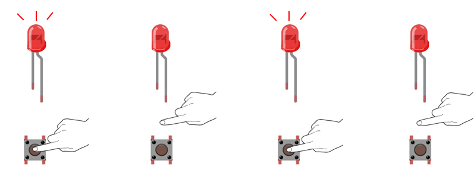

Upload Code to ESP32
-----------------------------------------

As shown in the following illustration, right-click file 02.1_ButtonAndLed and select "Upload to /" to upload code to ESP32.

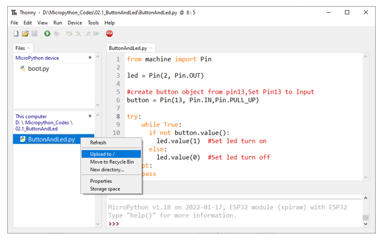

Upload boot.py in the same way.

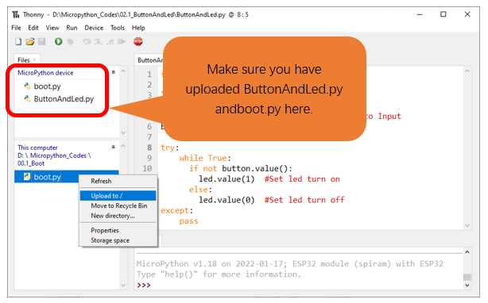

Press ESP32's reset key, and then push the button switch, LED turns ON; Push the button again, LED turns OFF.

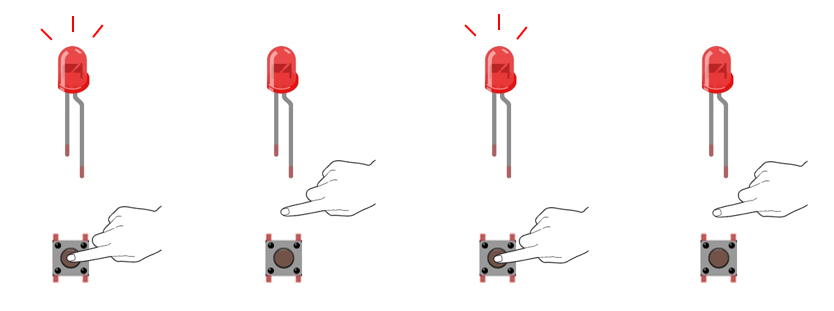

The following is the program code:

.. code-block:: python

    from machine import Pin

    led = Pin(2, Pin.OUT)

    #create button object from pin13,Set Pin13 to Input
    button = Pin(13, Pin.IN,Pin.PULL_UP) 

    try:
        while True:
        if not button.value():
            led.value(1)  #Set led turn on
        else:
            led.value(0)  #Set led turn off
    except:
        pass

In this project, we use the Pin module of the machine, so before initializing the Pin, we need to import this module first.

.. code-block:: python

    from machine import Pin

In the circuit connection, LED and Button are connected with GPIO2 and GPIO13 respectively, so define led and button as 2 and 13 respectively.

.. code-block:: python

    led = Pin(2, Pin.OUT)

    #create button object from pin13,Set Pin13 to Input
    button = Pin(13, Pin.IN,Pin.PULL_UP) 

Read the pin state of button with value() function. Press the button switch, the function returns low level and the result of "if" is true, and then LED will be turned ON; Otherwise, LED is turned OFF.

.. code-block:: python

    while True:
      if not button.value():
        led.value(1)  #Set led turn on
      else:
        led.value(0)  #Set led turn off

If statement is used to execute the next statement when a certain condition is proved to be true (or non0). It is often used together with "else" statement, which judges other statements except the if statement. If you need to judge if the result of a condition is 0, you can use if not statement.

.. code-block:: python

    if not button.value():
        ......
    else:
        ......

Project MINI table lamp
**************************************

We will also use a Push Button Switch, LED and ESP32 to make a MINI Table Lamp but this will function differently: Press the button, the LED will turn ON, and pressing the button again, the LED turns OFF. The ON switch action is no longer momentary (like a door bell) but remains ON without needing to continually press on the Button Switch.

First, let us learn something about the push button switch.

Debounce for Push Button 
================================

When a Momentary Push Button Switch is pressed, it will not change from one state to another state immediately. Due to tiny mechanical vibrations, there will be a short period of continuous buffeting before it completely reaches another state too fast for Humans to detect but not for computer microcontrollers. The same is true when the push button switch is released. This unwanted phenomenon is known as "bounce".

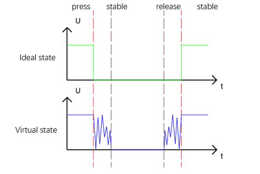

Therefore, if we can directly detect the state of the Push Button Switch, there are multiple pressing and releasing actions in one pressing cycle. This buffeting will mislead the high-speed operation of the microcontroller to cause many false decisions. Therefore, we need to eliminate the impact of buffeting. Our solution: to judge the state of the button multiple times. Only when the button state is stable (consistent) over a period of time, can it indicate that the button is actually in the ON state (being pressed). 

This project needs the same components and circuits as we used in the previous section.

Code
===============================

.. _Tablelamp:

Tablelamp
--------------------------------

Move the program folder " **Freenove_Ultimate_Starter_Kit_for_ESP32/Python/Python_Codes** " to disk(D) in advance with the path of " **D:/Micropython_Codes** ".

Open "Thonny", click "This computer"  ->  "D:"  ->  "Micropython_Codes"  ->  "02.2_TableLamp"and double click "TableLamp.py".

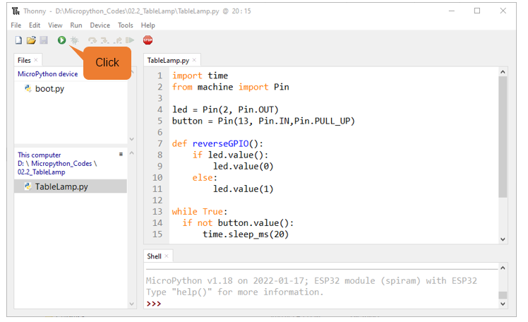

Click "Run current script" shown in the box of the above illustration, press the push button switch, LED turns ON; press it again, LED turns OFF. 

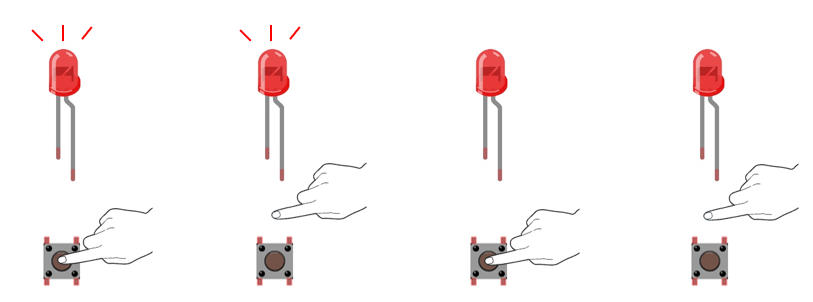

:red:`If you have any concerns, please contact us via:` support@freenove.com

Upload code to ESP32
--------------------------------

As shown in the following illustration, right-click file 02.2_TableLamp and select "Upload to /" to upload code to ESP32.

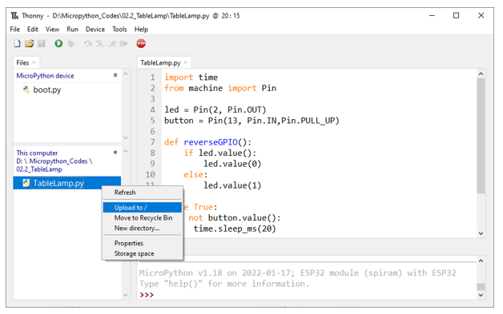

Upload boot.py in the same way

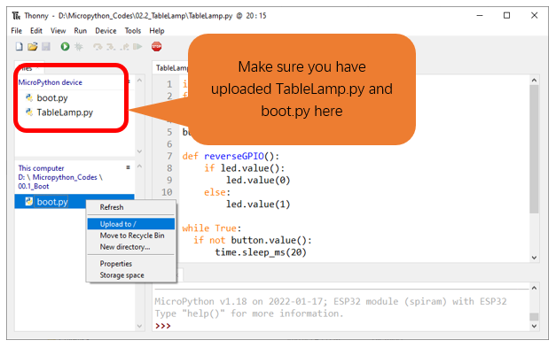

Press ESP32's reset key, and then push the button switch, LED turns ON; Push the button again, LED turns OFF.

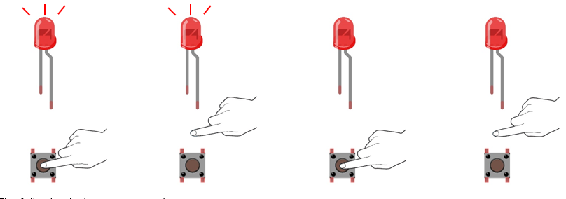

The following is the program code:

.. literalinclude:: ../../../freenove_Kit/Python/Python_Codes/02.2_TableLamp/TableLamp.py
    :language: python
    :dedent:

When the button is detected to be pressed, delay 20ms to avoid the effect of bounce, and then check whether the button has been pressed again. If so, the conditional statement will be executed, otherwise it will not be executed.

.. literalinclude:: ../../../freenove_Kit/Python/Python_Codes/02.2_TableLamp/TableLamp.py
    :language: python
    :lines: 13-19
    :dedent:

Customize a function and name it reverseGPIO(), which reverses the output level of the LED.

.. literalinclude:: ../../../freenove_Kit/Python/Python_Codes/02.2_TableLamp/TableLamp.py
    :language: python
    :lines: 7-11
    :dedent:
