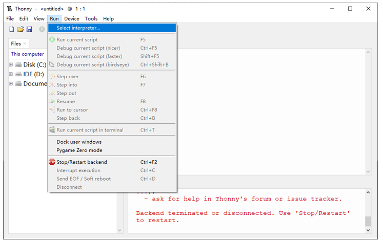
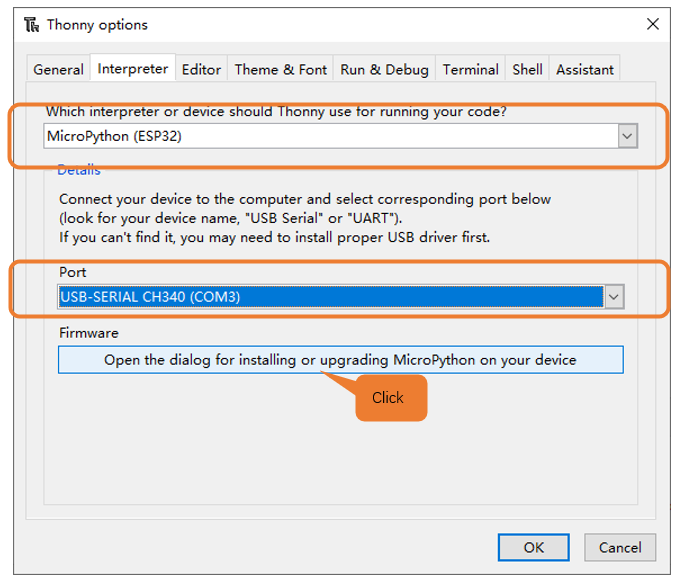
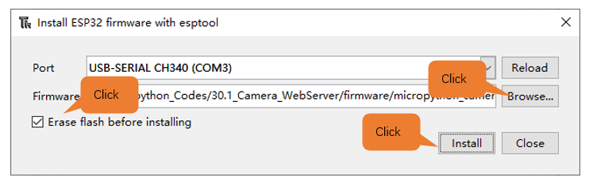
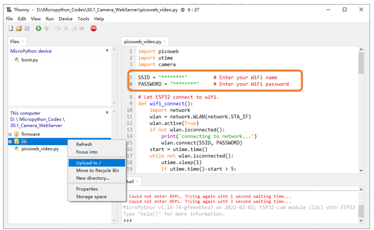
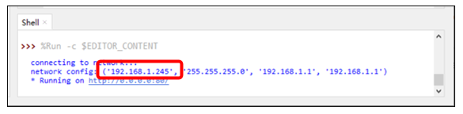
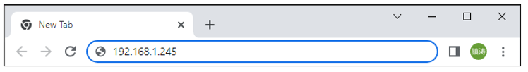
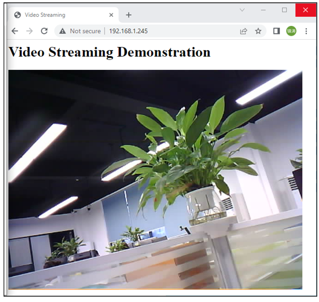

##############################################################################
Chapter Camera Web Server
##############################################################################

In this section, we'll use ESP32's video function as an example to study.

Project Camera Web Server
******************************************

Connect ESP32 using USB and check its IP address through serial monitor. Use web page to access IP address to obtain video and image data.

Component List
===========================================

+------------------------------------+-------------------------+
| ESP32-WROVER x1                    | Micro USB Wire x1       |
|                                    |                         |
| |Chapter01_00|                     | |Chapter08_00|          |
+------------------------------------+-------------------------+
  
.. |Chapter01_00| image:: ../_static/imgs/1_LED/Chapter01_00.png
.. |Chapter08_00| image:: ../_static/imgs/8_Serial_Communication/Chapter08_00.png

Circuit
=================================

Connect Freenove ESP32 to the computer using the USB cable.

.. image:: ../_static/imgs/32_WiFi_Working_Modes/Chapter32_01.png
    :align: center

Code
==================================

Move the program folder " **Freenove_Ultimate_Starter_Kit_for_ESP32/Python/Python_Codes** " to disk(D) in advance with the path of " **D:/Micropython_Codes** ".

Since Micropython does not provide firmware including camera module, in this chapter, we will use the camera based on the firmware in lemariva's Github project, micropython-camera-driver.

Project link: https://github.com/lemariva/micropython-camera-driver

Before starting the project, we need to re-upload the firmware with the camera module via steps below.

Open Thonny, click "run" and select "Select interpreter...""

Select "Micropython (ESP32)", select "USB-SERIAL CH340 (COM4)", and then click the long button under "Firmware".

In the new popup window, select corresponding "USB-SERIAL CH340 (COM3)" for port. Click "Browse", select " **30.1_Camera_WebServer\firmware\micropython_camera_feeeb5ea3_esp32_idf4_4.bin** ".

Select "Erase…" and click "Install"。

Wait for completion.

Open "Thonny", click "This computer"  ->  "D:"  ->  "Micropython_Codes"  ->  "30.1_Camera_WebServer". Select folder "lib", right click your mouse to select "Upload to /", wait for "lib" to be uploaded to ESP32-WROVER and then double click "picoweb_video.py".

Camera_WebServer
---------------------------------

Before running the program, please modify your router's name and password in the box shown in the illustration above to make sure that your code can compile and work successfully. 

Click "run" to run the code "picoweb_video.py", then you can see the following content in the shell area.

If your ESP32 has been in the process of connecting to router, but the information above has not been printed out, please re-check whether the router name and password have been entered correctly and press the reset key on ESP32-WROVER to wait for a successful connection prompt. 

Open a web browser, enter the IP address printed by the serial monitor in the address bar, and access it. 

Taking the Google browser as an example, here's what the browser prints out after successful access to ESP32's IP.

The effect is shown in the image below.

.. note::

    If the shell area prompts an error when you click to run the code, please press the rst button on the esp32, wait for the system reset to complete, and then re-run the code.

The following is the program code.

.. literalinclude:: ../../../freenove_Kit/Python/Python_Codes/30.1_Camera_WebServer/picoweb_video.py
    :language: python
    :dedent:

Import picoweb、utime、camera、gc modules.

.. literalinclude:: ../../../freenove_Kit/Python/Python_Codes/30.1_Camera_WebServer/picoweb_video.py
    :language: python
    :lines: 3-6
    :dedent:

Before running the code, please modify the WiFi name and password in the code to ensure that the ESP32 can connect to the network.

.. literalinclude:: ../../../freenove_Kit/Python/Python_Codes/30.1_Camera_WebServer/picoweb_video.py
    :language: python
    :lines: 8-9
    :dedent:

Define the WiFi connection function, set the ESP32 to STA mode, and let the ESP32 connect to the nearby WiFi. If the connection is successful, the WiFi configuration information of the ESP32 will be printed; if the connection fails, the connection timeout will be printed.

.. literalinclude:: ../../../freenove_Kit/Python/Python_Codes/30.1_Camera_WebServer/picoweb_video.py
    :language: python
    :lines: 12-26
    :dedent:

The deinit() is used to disable the configuration of the camera to prevent the previous configuration from interfering with the following configuration.

The init() is used to configure the camera's pin driver, image data format, resolution and other information. By default, please do not modify this function, otherwise the camera initialization fails and the image cannot be obtained.

.. literalinclude:: ../../../freenove_Kit/Python/Python_Codes/30.1_Camera_WebServer/picoweb_video.py
    :language: python
    :lines: 31-37
    :dedent:

This function can set the resolution of the camera individually, you can refer to the notes below to select the appropriate resolution size.

.. literalinclude:: ../../../freenove_Kit/Python/Python_Codes/30.1_Camera_WebServer/picoweb_video.py
    :language: python
    :lines: 39-45
    :dedent:

The following functions can modify the image information obtained by the camera.

.. literalinclude:: ../../../freenove_Kit/Python/Python_Codes/30.1_Camera_WebServer/picoweb_video.py
    :language: python
    :lines: 47-58
    :dedent:

This is the code for a simple web interface, used here as an example.

.. literalinclude:: ../../../freenove_Kit/Python/Python_Codes/30.1_Camera_WebServer/picoweb_video.py
    :language: python
    :lines: 61-72
    :dedent:

Web page response function. When a user visits the webpage "/" built by ESP32, ESP32 calls this function, allowing the user to observe a display interface in the browser.

.. literalinclude:: ../../../freenove_Kit/Python/Python_Codes/30.1_Camera_WebServer/picoweb_video.py
    :language: python
    :lines: 75-77
    :dedent:

send_frame() can send the image obtained by ESP32 in web page format. When someone visits the webpage "/video" built by the ESP32, the video(req, resp) function is used to continuously fetch images and send them to the browser.

.. literalinclude:: ../../../freenove_Kit/Python/Python_Codes/30.1_Camera_WebServer/picoweb_video.py
    :language: python
    :lines: 79-93
    :dedent:

Create two route decorators and declare their listening strings and corresponding response handlers respectively.

.. literalinclude:: ../../../freenove_Kit/Python/Python_Codes/30.1_Camera_WebServer/picoweb_video.py
    :language: python
    :lines: 96-100
    :dedent:

This is the main part of the program. First initialize the ESP32 camera, and then configure WiFi to connect the ESP32 to the network. Call the picoweb library, build a webserver, and run it.

.. literalinclude:: ../../../freenove_Kit/Python/Python_Codes/30.1_Camera_WebServer/picoweb_video.py
    :language: python
    :lines: 105-113
    :dedent:

Reference
----------------------------------------

+-------------------+-----------+------------------+-----------+
| Image resolution  | Sharpness | Image resolution | Sharpness |
+===================+===========+==================+===========+
| FRAMESIZE_96x96   | 96x96     | FRAMESIZE_HVGA   | 480x320   |
+-------------------+-----------+------------------+-----------+
| FRAMESIZE_QQVGA   | 160x120   | FRAMESIZE_VGA    | 640x480   |
+-------------------+-----------+------------------+-----------+
| FRAMESIZE_QCIF    | 176x144   | FRAMESIZE_SVGA   | 800x600   |
+-------------------+-----------+------------------+-----------+
| FRAMESIZE_HQVGA   | 240x176   | FRAMESIZE_XGA    | 1024x768  |
+-------------------+-----------+------------------+-----------+
| FRAMESIZE_240x240 | 240x240   | FRAMESIZE_HD     | 1280x720  |
+-------------------+-----------+------------------+-----------+
| FRAMESIZE_QVGA    | 320x240   | FRAMESIZE_SXGA   | 1280x1024 |
+-------------------+-----------+------------------+-----------+
| FRAMESIZE_CIF     | 400x296   | FRAMESIZE_UXGA   | 1600x1200 |
+-------------------+-----------+------------------+-----------+

:red:`We recommend that the resolution not exceed VGA(640x480).`
