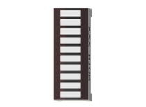
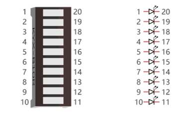
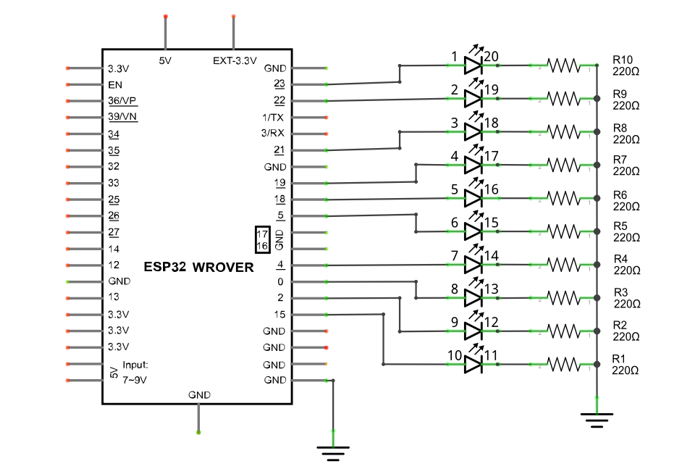
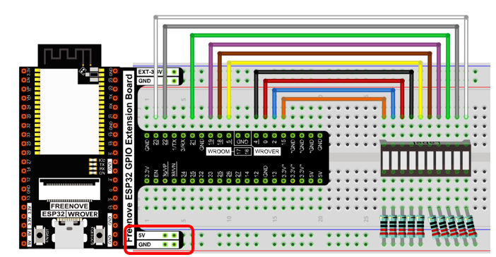
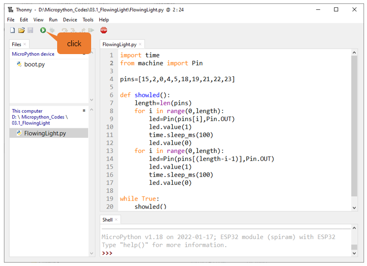
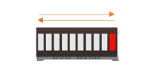

##############################################################################
Chapter LED Bar
##############################################################################

We have learned how to control a LED blinking, next we will learn how to control a number of LEDs.

Project Flowing Light
********************************

In this project, we use a number of LEDs to make a flowing light.

Component List
=====================================

+------------------------------------+-------------------------+
| ESP32-WROVER x1                    | GPIO Extension Board x1 |
|                                    |                         |
| |Chapter01_00|                     | |Chapter01_01|          |
+------------------------------------+-------------------------+
| Breadboard x1                                                |
|                                                              |
| |Chapter01_02|                                               |
+-----------------+------------------+-------------------------+
|Jumper M/M x10   | Resistor 220Ω x10| LED bar graph x1        |
|                 |                  |                         |
| |Chapter01_05|  | |Chapter01_04|   | |Chapter03_00|          |
+-----------------+------------------+-------------------------+

.. |Chapter01_00| image:: ../_static/imgs/1_LED/Chapter01_00.png
.. |Chapter01_01| image:: ../_static/imgs/1_LED/Chapter01_01.png
.. |Chapter01_02| image:: ../_static/imgs/1_LED/Chapter01_02.png
.. |Chapter01_04| image:: ../_static/imgs/1_LED/Chapter01_04.png
.. |Chapter01_05| image:: ../_static/imgs/1_LED/Chapter01_05.png

Component knowledge
===================================

Let's learn about the basic features of these components to use and understand them better.

LED bar
-----------------------------------

A LED bar graph has 10 LEDs integrated into one compact component. The two rows of pins at its bottom are paired to identify each LED like the single LED used earlier. 

Circuit
===================================

.. list-table:: 
   :width: 100%
   :header-rows: 1 
   :align: center
   
   * -  Schematic diagram
   * -  |Chapter03_02|
   * -  Hardware connection. 

        If you need any support, please feel free to contact us via: support@freenove.com

   * -  |Chapter03_03|

        :red:`If LED bar does not work, try to rotate it for 180°. The label is random.`

Code
========================

This project is designed to make a flowing water lamp. Which are these actions: First turn LED #1 ON, then turn it OFF. Then turn LED #2 ON, and then turn it OFF... and repeat the same to all 10 LEDs until the last LED is turns OFF. This process is repeated to achieve the "movements" of flowing water.

<<<<<<< HEAD
FlowingLight
=======
03.1_FlowingLight
>>>>>>> c02610ff4de2c29d754fb7b42146a6d9ce5b3380
------------------------------

Move the program folder "Freenove_Ultimate_Starter_Kit_for_ESP32/Python/Python_Codes" to disk(D) in advance with the path of "D:/Micropython_Codes".

Open "Thonny", click "This computer"  ->  "D:"  ->  "Micropython_Codes"  ->  "03.1_FlowingLight" and double click "FlowingLight.py".

Click "Run current script" shown in the box above, LED Bar Graph will light up from left to right and then back from right to left.

:red:`If you have any concerns, please contact us via:` support@freenove.com

The following is the program code:

.. literalinclude:: ../../../freenove_Kit/Python/Python_Codes/03.1_FlowingLight/FlowingLight.py
    :language: python
    :dedent:

Use an array to define 10 GPIO ports connected to LED Bar Graph for easier operation.

.. literalinclude:: ../../../freenove_Kit/Python/Python_Codes/03.1_FlowingLight/FlowingLight.py
    :language: python
    :lines: 4-4
    :dedent:

Use len() function to obtain the amount of elements in the list and use a for loop to configure pins as output mode.

.. literalinclude:: ../../../freenove_Kit/Python/Python_Codes/03.1_FlowingLight/FlowingLight.py
    :language: python
    :lines: 7-9
    :dedent:

Use two for loops to turn on LEDs separately from left to right and then back from right to left.

.. literalinclude:: ../../../freenove_Kit/Python/Python_Codes/03.1_FlowingLight/FlowingLight.py
    :language: python
    :lines: 8-17
    :dedent:

Reference
-----------------------------

.. py:function:: for i in range(start,end,num: int=1)	

    For loop is used to execute a program endlessly and iterate in the order of items (a list or a string) in the sequence 

    start: The initial value, the for loop starts with it 

    end: The ending value, the for loop end with it

    num: Num is automatically added each time to the data. The default value is 1
