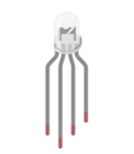
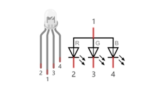
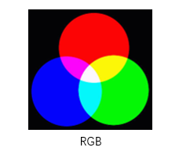
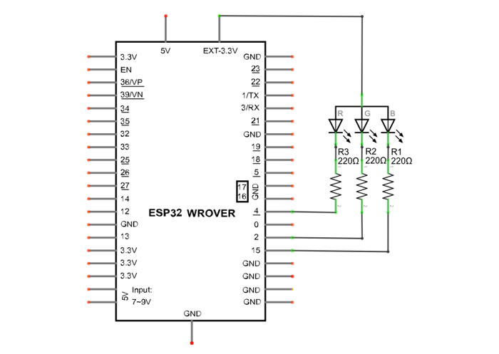
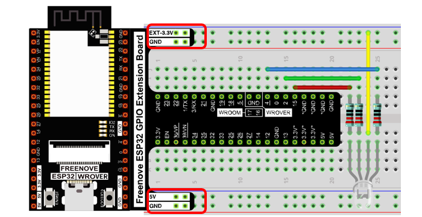
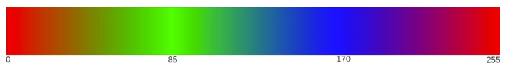

##############################################################################
Chapter RGB LED
##############################################################################

In this chapter, we will learn how to control a RGB LED. It can emit different colors of light. Next, we will use RGB LED to make a multicolored light.

Project Random Color Light
******************************************

In this project, we will make a multicolored LED. And we can control RGB LED to switch different colors automatically.

Component List
==========================================

.. table::
    :width: 80%
    :align: center
    :class: table-line
    
    +------------------------------------+-------------------------+
    | ESP32-WROVER x1                    | GPIO Extension Board x1 |
    |                                    |                         |
    | |Chapter01_00|                     | |Chapter01_01|          |
    +------------------------------------+-------------------------+
    | Breadboard x1                                                |
    |                                                              |
    | |Chapter01_02|                                               |
    +-----------------+------------------+-------------------------+
    | RGBLED x1       | Resistor 220Ω x1 | Jumper M/M x2           |
    |                 |                  |                         |
    | |Chapter05_00|  | |Chapter01_04|   | |Chapter01_05|          |
    +-----------------+------------------+-------------------------+
  
.. |Chapter01_00| image:: ../_static/imgs/1_LED/Chapter01_00.png    
.. |Chapter01_01| image:: ../_static/imgs/1_LED/Chapter01_01.png    
.. |Chapter01_02| image:: ../_static/imgs/1_LED/Chapter01_02.png    

.. |Chapter01_04| image:: ../_static/imgs/1_LED/Chapter01_04.png    
.. |Chapter01_05| image:: ../_static/imgs/1_LED/Chapter01_05.png    

Related knowledge
===========================================

RGB LED has integrated 3 LEDs that can respectively emit red, green and blue light. And it has 4 pins. The long pin (1) is the common port, that is, 3 LED 's positive or negative port. The RGB LED with common positive port and its symbol is shown below. We can make RGB LED emit various colors of light by controlling these 3 LEDs to emit light with different brightness, 

Red, green, and blue are known as three primary colors. When you combine these three primary-color lights with different brightness, it can produce almost all kinds of visible lights. Computer screens, single pixel of cell phone screen, neon, and etc. are working under this principle.

If we use three 8-bit PWMs to control the RGB LED, in theory, we can create 28*28*28=16777216 (16 million) colors through different combinations.

Circuit
===========================================

.. list-table:: 
   :width: 80%
   :align: center
   :class: table-line
   
   * -  **Schematic diagram**
   * -  |Chapter05_03|
   * -  **Hardware connection** 

   * -  :combo:`red font-bolder:If you need any support, please feel free to contact us via:` support@freenove.com

        |Chapter05_04|

Code
============================================

We need to create three PWM channels and use random duty cycle to make random RGBLED color.

Move the program folder "Freenove_Ultimate_Starter_Kit_for_ESP32/Python/Python_Codes" to disk(D) in advance with the path of "D:/Micropython_Codes".

Open "Thonny", click "This computer"  ->  "D:"  ->  "Micropython_Codes"  ->  "05.1_RandomColorLight"and double click "RandomColorLight.py". 

RandomColorLight
----------------------------------------------

Click "Run current script", RGBLED begins to display random colors.

:combo:`red font-bolder:If you have any concerns, please contact us via:` support@freenove.com

The following is the program code:

.. literalinclude:: ../../../freenove_Kit/Python/Python_Codes/05.1_RandomColorLight/RandomColorLight.py
    :linenos:
    :language: python
    :dedent:

Import Pin, PWM and Randon Function modules. 

.. literalinclude:: ../../../freenove_Kit/Python/Python_Codes/05.1_RandomColorLight/RandomColorLight.py
    :linenos:
    :language: python
    :lines: 1-3
    :dedent:

Configure ouput mode of GPIO15, GPIO2 and GPIO0 as PWM output and PWM frequency as 10000Hz 

.. literalinclude:: ../../../freenove_Kit/Python/Python_Codes/05.1_RandomColorLight/RandomColorLight.py
    :linenos:
    :language: python
    :lines: 5-9
    :dedent:

Define a function to set the color of RGBLED.

.. literalinclude:: ../../../freenove_Kit/Python/Python_Codes/05.1_RandomColorLight/RandomColorLight.py
    :linenos:
    :language: python
    :lines: 11-14
    :dedent:

Call random function randint()to generate a random number in the range of 0-1023 and assign the value to red.

.. literalinclude:: ../../../freenove_Kit/Python/Python_Codes/05.1_RandomColorLight/RandomColorLight.py
    :linenos:
    :language: python
    :lines: 18-18
    :dedent:

Obtain 3 random number every 200 milliseconds and call function setColor to make RGBLED display dazzling colors.

.. literalinclude:: ../../../freenove_Kit/Python/Python_Codes/05.1_RandomColorLight/RandomColorLight.py
    :linenos:
    :language: python
    :lines: 17-22
    :dedent:

Reference
------------------------------

.. py:function:: Class random	
    
    Before each use of the module **random** , please add the statement " **import random** " to  the top of Python file.
    
    **randint(start, end):** Randomly generates an integer between the value of start and end.
    
        **start:** Starting value in the specified range, which would be included in the range.
        
        **end:** Ending value in the specified range, which would be included in the range.
        
        **random():** Randomly generates a floating point number between 0 and 1.
    
    **random.unifrom(start, end):** Randomly generates a floating point number between the value of start and end
    
        **start:** Starting value in the specified range, which would be included in the range.
    
        **end:** Ending value in the specified range, which would be included in the range.
    
    **random.getrandbits(size):** Generates an integer with size random bits
    
    For example: 
    
        size = 4, it generates an integer in the range of 0 to 0b1111
    
        size = 8, it generates an integer in the range of 0 to 0b11111111
    
    **random.randrange(start, end, step):** Randomly generates a positive integer in the range from start to end and increment to step. 
    
        **start:** Starting value in the specified range, which would be included in the range
    
        **end:** Ending value in the specified range, which would be included in the range. 
    
        **step:** An integer specifying the incrementation.
    
    **random.seed(sed):** Specifies a random seed, usually being applied in conjunction with other random number generators 
    
        **sed:** Random seed, a starting point in generating random numbers.
    
    **random.choice(obj):** Randomly generates an element from the object obj. 
    
        **obj:** list of elements 

Project Gradient Color Light
*********************************************

In the previous project, we have mastered the usage of RGBLED, but the random color display is rather stiff. This project will realize a fashionable Light with soft color changes.

Component list, the circuit is exactly the same as the project random color light.

Using a color model, the color changes from 0 to 255 as shown below. 

In this code, the color model will be implemented and RGBLED will change colors along the model.

Open "Thonny", click"This computer"  ->  "D:"  ->  "Micropython_Codes"  ->  "05.2_GradientColorLight" and double click "GradientColorLight.py". 

GradientColorLight
----------------------------------

The following is the program code:

.. literalinclude:: ../../../freenove_Kit/Python/Python_Codes/05.2_GradientColorLight/GradientColorLight.py
    :linenos:
    :language: python
    :dedent:

The function wheel() is a color selection method of the color model introduced earlier. The value range of the parameter pos is 0-1023. The function will return a data containing the duty cycle values of 3 pins. 

.. literalinclude:: ../../../freenove_Kit/Python/Python_Codes/05.2_GradientColorLight/GradientColorLight.py
    :linenos:
    :language: python
    :lines: 19-37
    :dedent:

