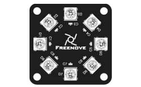
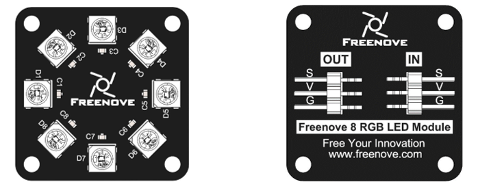
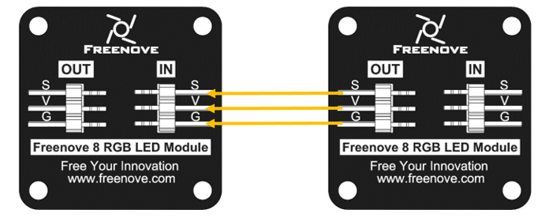
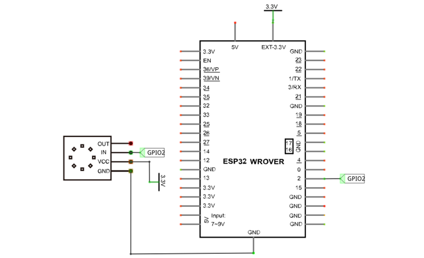
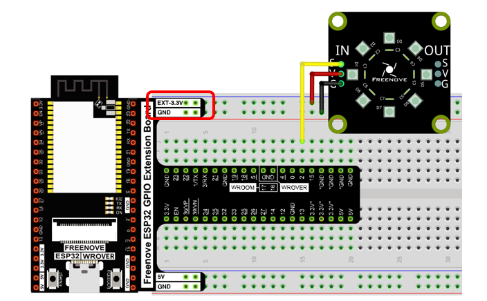
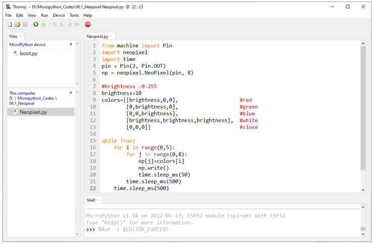
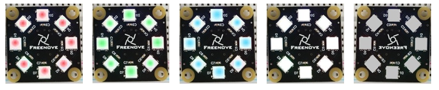
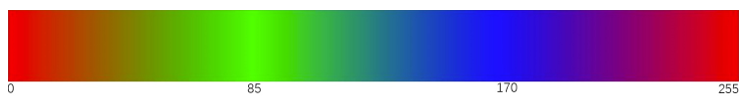
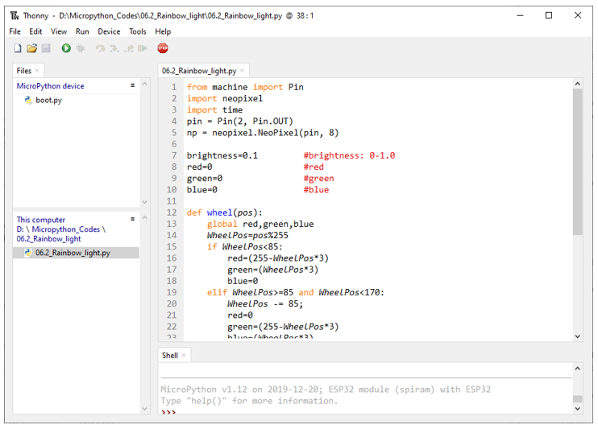
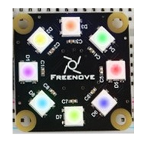

##############################################################################
Chapter LEDPixel
##############################################################################

This chapter will help you learn to use a more convenient RGB LED lamp, which requires only one GPIO control and can be connected in infinite series in theory. Each LED can be controlled independently.

Project LEDPixel
************************************

Learn the basic usage of LEDPixel and use it to flash red, green, blue and white.

Component List
======================================

+------------------------------------+-------------------------+
| ESP32-WROVER x1                    | GPIO Extension Board x1 |
|                                    |                         |
| |Chapter01_00|                     | |Chapter01_01|          |
+------------------------------------+-------------------------+
| Breadboard x1                                                |
|                                                              |
| |Chapter01_02|                                               |
+------------------------------------+-------------------------+
| Freenove 8 RGB LED Module x1       | Jumper M/M x2           |
|                                    |                         |
| |Chapter06_00|                     | |Chapter01_05|          |
+------------------------------------+-------------------------+
  
.. |Chapter01_00| image:: ../_static/imgs/1_LED/Chapter01_00.png
.. |Chapter01_01| image:: ../_static/imgs/1_LED/Chapter01_01.png
.. |Chapter01_02| image:: ../_static/imgs/1_LED/Chapter01_02.png
.. |Chapter01_05| image:: ../_static/imgs/1_LED/Chapter01_05.png

Related knowledge
=====================================

Freenove 8 RGB LED Module  
------------------------------------

The Freenove 8 RGB LED Module is as below. 

It consists of 8 WS2812, each of which requires only one pin to control and supports cascade. Each WS212 has integrated 3 LEDs, red, green and blue respectively, and each of them supports 256-level brightness adjustment, which means that each WS2812 can emit 2^24=16,777,216 different colors.

You can use only one data pin to control eight LEDs on the module. As shown below:

And you can also control many modules at the same time. Just connect OUT pin of one module to IN pin of another module. In this way, you can use one data pin to control 8, 16, 32 … LEDs.

Pin description:

+---------------------------------------+---------------------------------------+
|         (IN)                          |        (OUT)                          |
+========+==============================+========+==============================+
| symbol | Function                     | symbol | Function                     |
+--------+------------------------------+--------+------------------------------+
| S      | Input control signal         | S      | Output control signal        |
+--------+------------------------------+--------+------------------------------+
| V      | Power supply pin, +3.5V~5.5V | V      | Power supply pin, +3.5V~5.5V |
+--------+------------------------------+--------+------------------------------+
| G      | GND                          | G      | GND                          |
+--------+------------------------------+--------+------------------------------+

Circuit
======================================

.. list-table:: 
   :width: 100%
   :header-rows: 1 
   :align: center
   
   * -  Schematic diagram
   * -  |Chapter06_03|
   * -  Hardware connection. 

        :red:`If you need any support, please feel free to contact us via:` support@freenove.com

   * -  |Chapter06_04|

Code
=======================================

Move the program folder "Freenove_Ultimate_Starter_Kit_for_ESP32/Python/Python_Codes" to disk(D) in advance with the path of "D:/Micropython_Codes".

Open "Thonny", click "This computer"  ->  "D:"  ->  "Micropython_Codes"  ->  "06.1_Neopixel" and double click "Neopixel.py". 

Neopixel
---------------------------------------

Click "Run current script", and Neopixel begins to light up in red, green, blue, white and black.

The following is the program code:

.. literalinclude:: ../../../freenove_Kit/Python/Python_Codes/06.1_Neopixel/Neopixel.py
    :language: python
    :dedent:

Import Pin, neopiexl and time modules.

.. literalinclude:: ../../../freenove_Kit/Python/Python_Codes/06.1_Neopixel/Neopixel.py
    :language: python
    :lines: 1-3
    :dedent:

Define the number of pin and LEDs connected to neopixel. 

.. literalinclude:: ../../../freenove_Kit/Python/Python_Codes/06.1_Neopixel/Neopixel.py
    :language: python
    :lines: 4-5
    :dedent:

Define the brightness of neopixel's LED and an array to store color.

.. literalinclude:: ../../../freenove_Kit/Python/Python_Codes/06.1_Neopixel/Neopixel.py
    :language: python
    :lines: 7-13
    :dedent:

Assign the color data to the array np and call function write() to send np array data to neopixel module.

.. literalinclude:: ../../../freenove_Kit/Python/Python_Codes/06.1_Neopixel/Neopixel.py
    :language: python
    :lines: 18-19
    :dedent:

Nest two for loops to make the module repeatedly display five states of red, green, blue, white and OFF.

.. literalinclude:: ../../../freenove_Kit/Python/Python_Codes/06.1_Neopixel/Neopixel.py
    :language: python
    :lines: 15-22
    :dedent:

Reference
---------------------------------

.. py:function:: Class neopixel	
    
    Before each usr of **neopixel** module, please add the statement " **import neopixel** " to the top of Python file.
    
    **NeoPixel(pin, n):** Define the number of output pins and LEDs of neopixel module 
    
        **pin:** Output pins
    
        **n:** The number of LEDs.
    
    **NeoPixel.write():** Write data to LEDs.

.. _Rainbow_Light:

Project Rainbow Light
*************************************

In the previous project, we have mastered the usage of NeoPixel. This project will realize a slightly complicated Rainbow Light. The component list and the circuit are exactly the same as the project fashionable Light.

Code
=====================================

Continue to use the following color model to equalize the color distribution of the 8 leds and gradually change. 

Move the program folder "Freenove_Ultimate_Starter_Kit_for_ESP32/Python/Python_Codes" to disk(D) in advance with the path of "D:/Micropython_Codes".

Open "Thonny", click "This computer"  ->  "D:"  ->  "Micropython_Codes"  ->  "06.2_Rainbow_light" and then double click "Rainbow_light.py". 

06.2_Rainbow_light
------------------------------------

Click "Run current script", and the Freenove 8 RGB LED Strip displays different colors and the color changes gradually.

The following is the program code:

.. literalinclude:: ../../../freenove_Kit/Python/Python_Codes/06.2_Rainbow_light/Rainbow_light.py
    :language: python
    :dedent:

Define a wheel() function to process the color data of neopixel module.

.. literalinclude:: ../../../freenove_Kit/Python/Python_Codes/06.2_Rainbow_light/Rainbow_light.py
    :language: python
    :lines: 12-28
    :dedent:

Set the color brightness of the module.

.. literalinclude:: ../../../freenove_Kit/Python/Python_Codes/06.2_Rainbow_light/Rainbow_light.py
    :language: python
    :lines: 7-7
    :dedent:

Use a nesting of two for loops. The first for loop makes the value of i increase from 0 to 255 automatically and the wheel() function processes the value of i into data of the module's three colors; the second for loop writes the color data to the module.

.. literalinclude:: ../../../freenove_Kit/Python/Python_Codes/06.2_Rainbow_light/Rainbow_light.py
    :language: python
    :lines: 31-36
    :dedent: