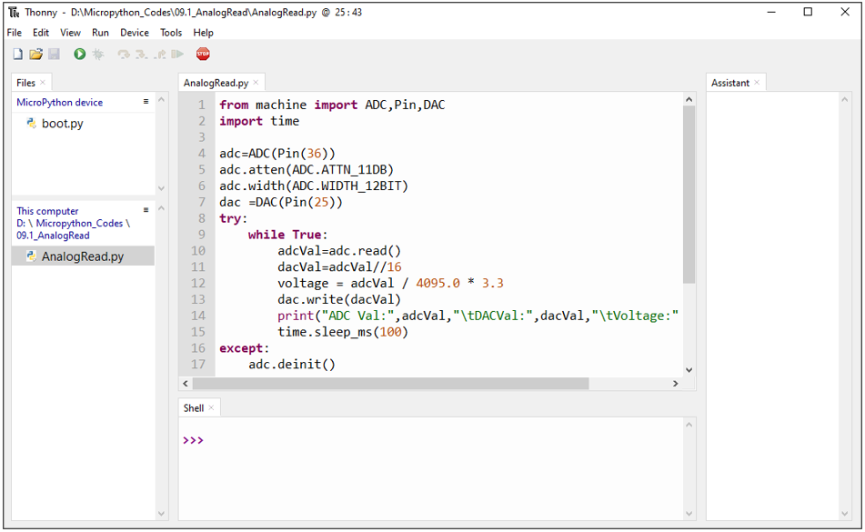

##############################################################################
Chapter AD/DA Converter
##############################################################################

We have learned how to control the brightness of LED through PWM and understood that PWM is not the real analog before. In this chapter, we will learn how to read analog, convert it into digital and convert the digital into analog output. That is, ADC and DAC.

Project Read the Voltage of Potentiometer 
******************************************************

In this project, we will use the ADC function of ESP32 to read the voltage value of potentiometer. And then output the voltage value through the DAC to control the brightness of LED.

Component List
==============================================

.. table::
    :width: 80%
    :align: center
    :class: table-line
    
    +------------------------------------+----------------------------------------------------+
    | ESP32-WROVER x1                    | GPIO Extension Board x1                            |
    |                                    |                                                    |
    | |Chapter01_00|                     | |Chapter01_01|                                     |
    +------------------------------------+----------------------------------------------------+
    | Breadboard x1                                                                           |
    |                                                                                         |
    | |Chapter01_02|                                                                          |
    +-----------------+------------------+------------------------+---------------------------+
    | LED x1          | Resistor 220Ω x1 | Jumper M/M x5          | Rotary potentiometer x1   |
    |                 |                  |                        |                           |
    | |Chapter01_03|  | |Chapter01_04|   | |Chapter01_05|         | |Chapter09_00|            |
    +-----------------+------------------+------------------------+---------------------------+

.. |Chapter01_00| image:: ../_static/imgs/1_LED/Chapter01_00.png
.. |Chapter01_01| image:: ../_static/imgs/1_LED/Chapter01_01.png
.. |Chapter01_02| image:: ../_static/imgs/1_LED/Chapter01_02.png
.. |Chapter01_03| image:: ../_static/imgs/1_LED/Chapter01_03.png 
.. |Chapter01_04| image:: ../_static/imgs/1_LED/Chapter01_04.png    
.. |Chapter01_05| image:: ../_static/imgs/1_LED/Chapter01_05.png
.. |Chapter09_00| image:: ../_static/imgs/9_AD_DA_Converter/Chapter09_00.png

Related knowledge
=====================================

ADC
--------------------------------

An ADC is an electronic integrated circuit used to convert analog signals such as voltages to digital or binary form consisting of 1s and 0s. The range of our ADC on ESP32 is 12 bits, that means the resolution is 2^12=4096, and it represents a range (at 3.3V) will be divided equally to 4096 parts. The rage of analog values corresponds to ADC values. So the more bits the ADC has, the denser the partition of analog will be and the greater the precision of the resulting conversion.

.. image:: ../_static/imgs/9_AD_DA_Converter/Chapter09_01.png
    :align: center

Subsection 1: the analog in rang of 0V---3.3/4095 V corresponds to digital 0;

Subsection 2: the analog in rang of 3.3/4095 V---2*3.3 /4095V corresponds to digital 1;

\.\.\.\.\.\.

The following analog will be divided accordingly.

The conversion formula is as follows:

.. image:: ../_static/imgs/9_AD_DA_Converter/Chapter09_02.png
    :align: center

DAC
---------------------------------

The reversing of this process requires a DAC, Digital-to-Analog Converter. The digital I/O port can output high level and low level (0 or 1), but cannot output an intermediate voltage value. This is where a DAC is useful.  ESP32 has two DAC output pins with 8-bit accuracy, GPIO25 and GPIO26, which can divide VDD (here is 3.3V) into 2*8=256 parts. For example, when the digital quantity is 1, the output voltage value is 3.3/256 \*1 V, and when the digital quantity is 128, the output voltage value is 3.3/256 \*128=1.65V, the higher the accuracy of DAC, the higher the accuracy of output voltage value will be.

The conversion formula is as follows:

ADC on ESP32
----------------------------------

ESP32 has 6 pins can be used to measure analog signals. GPIO pin sequence number and analog pin definition are shown in the following table.

.. table::
    :align: center
    :class: zebra
    
    +---------------------+-------------------+
    | ADC number in ESP32 | ESP32 GPIO number |
    +=====================+===================+
    | ADC1                | GPIO 36           |
    +---------------------+-------------------+
    | ADC2                | GPIO 39           |
    +---------------------+-------------------+
    | ADC3                | GPIO 34           |
    +---------------------+-------------------+
    | ADC4                | GPIO 35           |
    +---------------------+-------------------+
    | ADC5                | GPIO 32           |
    +---------------------+-------------------+
    | ADC6                | GPIO 33           |
    +---------------------+-------------------+

The analog pin number is also defined in ESP32's code base. For example, you can replace GPIO36 with A0 in the code.

.. note::
    
    ADC2 is disabled when ESP32's WiFi function is enabled.

DAC on ESP32
--------------------------------------

ESP32 has two 8-bit digital analog converters to be connected to GPIO25 and GPIO26 pins, respectively, and it is immutable. As shown in the following table.

.. table::
    :align: center
    :class: zebra
    
    +---------------------+-------------+
    | Simulate pin number | GPIO number |
    +=====================+=============+
    | DAC1                | 25          |
    +---------------------+-------------+
    | DAC2                | 26          |
    +---------------------+-------------+

The DAC pin number is already defined in ESP32's code base; for example, you can replace GPIO25 with DAC1 in the code.

.. note::
    
    **In this ESP32, GPIO26 is used as the camera's IIC-SDA pin, which is connected to 3.3V through a resistor.Therefore, DAC2 cannot be used.**

Component knowledge
====================================

Potentiometer
---------------------------------

Potentiometer is a resistive element with three Terminal parts. Unlike the resistors that we have used thus far in our project which have a fixed resistance value, the resistance value of a potentiometer can be adjusted. A potentiometer is often made up by a resistive substance (a wire or carbon element) and movable contact brush. When the brush moves along the resistor element, there will be a change in the resistance of the potentiometer’s output side (3) (or change in the voltage of the circuit that is is a part). The illustration below represents a linear sliding potentiometer and its electronic symbol on the right.

.. image:: ../_static/imgs/9_AD_DA_Converter/Chapter09_04.png
    :align: center

What between potentiometer pin 1 and pin 2 is the resistor body, and pins 3 is connected to brush. When brush moves from pin 1 to pin 2, the resistance between pin 1 and pin 3 will increase up to body resistance linearly, and the resistance between pin 2 and pin 3 will decrease down to 0 linearly.

In the circuit. The both sides of resistance body are often connected to the positive and negative electrode of the power. When you slide the brush pin 3, you can get a certain voltage in the range of the power supply.

.. image:: ../_static/imgs/9_AD_DA_Converter/Chapter09_05.png
    :align: center

Rotary potentiometer 
---------------------------------------------

Rotary potentiometer and linear potentiometer have similar function; their only difference is: the resistance is adjusted by rotating the potentiometer.

Circuit
=====================================

.. list-table:: 
   :width: 80%
   :class: table-line
   :align: center
   
   * -  **Schematic diagram**
   * -  |Chapter09_07|
   * -  **Hardware connection** 
       
   * -  :combo:`red font-bolder:If you need any support, please contact us via:` support@freenove.com
        
        |Chapter09_08|

.. |Chapter09_07| image:: ../_static/imgs/9_AD_DA_Converter/Chapter09_07.png    

Code
=======================================

Move the program folder **"Freenove_Ultimate_Starter_Kit_for_ESP32/Python/Python_Codes"** to disk(D) in advance with the path of "D:/Micropython_Codes".

Open "Thonny", click "This computer"  **->**  "D:"  **->**  "Micropython_Codes"  **->**  "09.1_AnalogRead and then click "AnalogRead.py". 

AnalogRead 
-------------------------------------------

Click "Run current script" and observe the message printed in "Shell".

LEDs display as below: 

"Shell" prints ADC value, DAC value, the output voltage of potentiometer and other information. In the code, we make the output voltage of the DAC pin equal to the input voltage of the ADC pin. Rotate the handle of the potentiometer, the printed information will change. When the voltage is greater than 1.6V (turn-on voltage of red LED), the LED starts to emit light. If you continue to increase the output voltage, the LED will gradually become brighter. And when the voltage is less than 1.6V, the LED will not light up, because this does not reach the turn-on voltage of the LED, which indirectly proves the difference between DAC and PWM. (If you have an oscilloscope, you can view the waveform output by the DAC through the oscilloscope)

The following is the code:

.. literalinclude:: ../../../freenove_Kit/Python/Python_Codes/09.1_AnalogRead/AnalogRead.py
    :linenos:
    :language: python
    :dedent:

Import Pin, ADC and DAC modules.

.. literalinclude:: ../../../freenove_Kit/Python/Python_Codes/09.1_AnalogRead/AnalogRead.py
    :linenos:
    :language: python
    :lines: 1-2
    :dedent:

Turn on and configure the ADC with the range of 0-3.3V and the data width of 12-bit data width, and turn on the DAC pin.

.. literalinclude:: ../../../freenove_Kit/Python/Python_Codes/09.1_AnalogRead/AnalogRead.py
    :linenos:
    :language: python
    :lines: 4-7
    :dedent:

Read ADC value once every 100 millisecods, convert ADC value to DAC value and output it, control the brightness of LED and print these data to "Shell".

.. literalinclude:: ../../../freenove_Kit/Python/Python_Codes/09.1_AnalogRead/AnalogRead.py
    :linenos:
    :language: python
    :lines: 9-15
    :dedent:

Reference
--------------------------------

.. py:function:: Class ADC	
    
    Before each use of ACD module, please add the statement "from machine import ADC" to the top of the python file.
    
    **machine.ADC(pin):** Create an ADC object associated with the given pin.
    
        **pin:** Available pins are: Pin(36)、Pin(39)、Pin(34)、Pin(35)、Pin(32)、Pin(33)。
    
    **ADC.read():** Read ADC and return the value.
    
        **ADC.atten(db):** Set attenuation ration (that is, the full range voltage, such as the voltage of 11db full range is 3.3V)
    
        **db:** attenuation ratio
    
        **ADC.ATTIN_0DB**    —full range of 1.2V
    
        **ADC.ATTN_2_5_DB**  —full range of 1.5V
    
        **ADC.ATTN_6DB**    —full range of 2.0 V
    
        **ADC.ATTN_11DB**   —full range of 3.3V
    
    **ADC.width(bit):** Set data width.
    
        **bit:** data bit
    
        **ADC.WIDTH_9BIT**  —9 data width 
    
        **ADC.WIDTH_10BIT** — 10 data width
    
        **ADC.WIDTH_11BIT** — 11 data width
    
        **ADC.WIDTH_12BIT** — 12 data width 

.. py:function:: Class DAC
    
    Before each use of **DAC** module, please add the statement " **from machine import DAC** " to the top of the python file.
    
    **machine.DAC(pin):** Create a DAC object associated with the given pin.
        
        **pin:** Available pins are: Pin(25)、Pin(26)
        
    **DAC.write(value):** Output voltage
    
        **value:** The range of data value: 0-255, corresponding output voltage of 0-3.3V