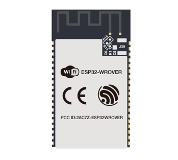
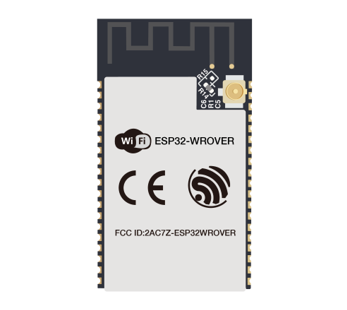
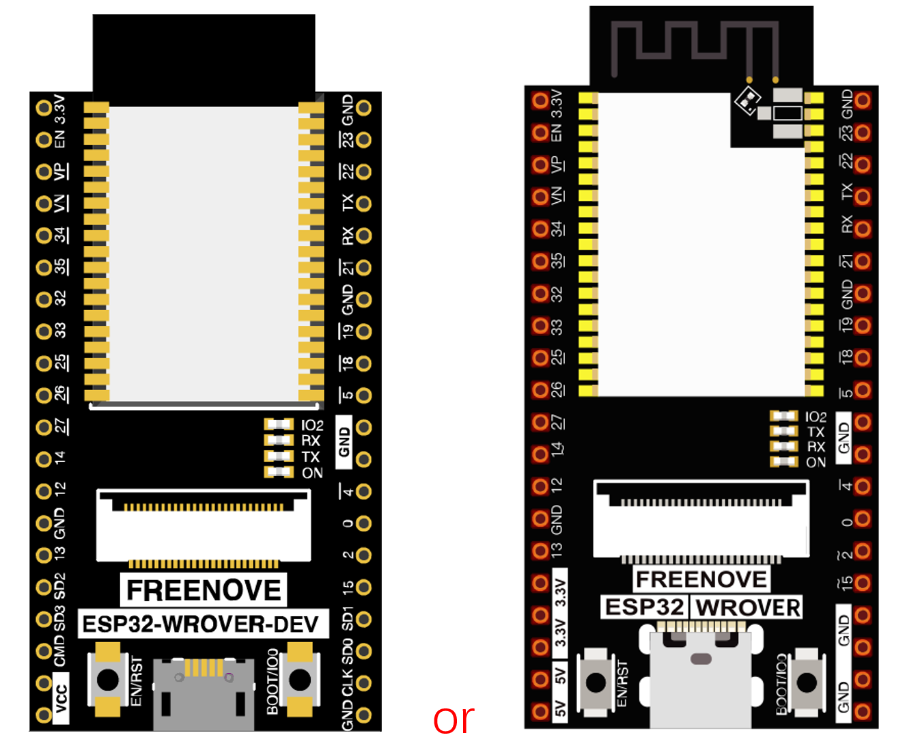
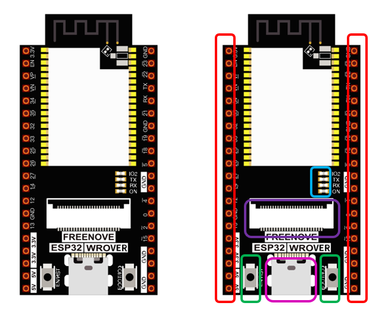
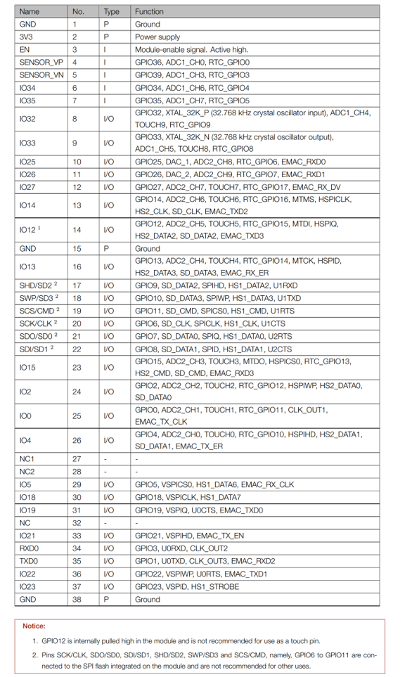
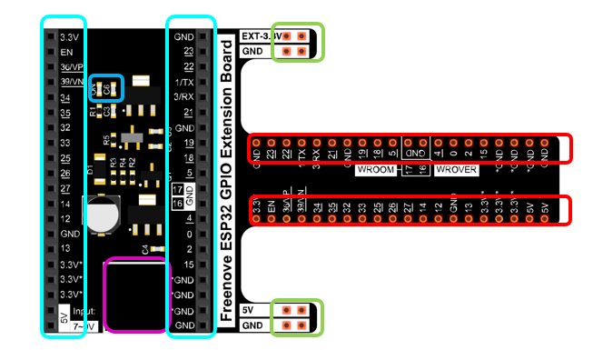

##############################################################################
Prepare
##############################################################################

ESP32 is a micro control unit with integrated Wi-Fi launched by Espressif, which features strong properties and integrates rich peripherals. It can be designed and studied as an ordinary Single Chip Micyoco(SCM) chip, or connected to the Internet and used as an Internet of Things device.

ESP32 can be developed both either with C/C++ language or micropython language. In this tutorial, we use micropython. With Micropython is as easy to learn as Python with little code, making it ideal for beginners.

Moreover, the code of ESP32 is completely open-source, so beginners can quickly learn how to develop and design IOT smart household products including smart curtains, fans, lamps and clocks.

We divide each project into four parts, namely Component List, Component Knowledge, Circuit and Code. Component List helps you to prepare material for the experiment more quickly. Component Knowledge allows you to quickly understand new electronic modules or components, while Circuit helps you understand the operating principle of the circuit. And Code allows you to easily master the use of ESP32 and its accessory kit. After finishing all the projects in this tutorial, you can also use these components and modules to make products such as smart household, smart cars and robots to transform your creative ideas into prototypes and new and innovative products.

In addition, if you have any difficulties or questions with this tutorial or toolkit, feel free to ask for our quick and free technical support through support@freenove.com

ESP32-WROVER
**************************************

ESP32-WROVER has launched a total of two antenna packages, PCB on-board antenna and IPEX antenna respectively. The PCB on-board antenna is an integrated antenna in the chip module itself, so it is convenient to carry and design. The IPEX antenna is a metal antenna derived from the integrated antenna of the chip module itself, which is used to enhance the signal of the module.

.. list-table:: 
   :width: 80%
   :header-rows: 1 
   :align: center
   :class: table-line
   
   * -  PCB on-board antenna 
     -  IPEX antenna
   
   * -  |Preface00|
     -  |Preface01| 
  

In this tutorial, the ESP32-WROVER is designed based on the PCB on-board antenna-packaged ESP32-WROVER module. 

ESP32-WROVER

**The version on the left is no longer mass-produced, and we mainly maintain the version on the right.**

Please note that there are many pirated versions of the ESP32 WROVER that look very similar to the version on the left. None of them will carry our logo and Freenove font.

We do not sell pirated ESP32 WROVER, nor do we provide after-sales service for pirated.

The hardware interfaces of ESP32-WROVER are distributed as follows:

Compare the left and right images. We've boxed off the resources on the ESP32-WROVER in different colors to facilitate your understanding of the ESP32-WROVER.

.. list-table:: 
   :widths: 10 10
   :header-rows: 1 
   :align: center
   :class: table-line
   
   * -  Box color 
     -  Corresponding resources introduction

   * -  |Preface04|
     -  GPIO pin

   * -  |Preface05|
     -  LED indicator

   * -  |Preface06|
     -  Camera interface

   * -  |Preface07|
     -  Reset button, Boot mode selection button 

   * -  |Preface08|
     -  USB portX

For more information, please visit: https://www.espressif.com/sites/default/files/documentation/esp32-wrover_datasheet_en.pdf

Extension board of the ESP32-WROVER
**********************************************
And we also design an extension board, so that you can use the ESP32 more easily in accordance with the circuit diagram provided. The followings are their photos. 

The hardware interfaces of ESP32-WROVER are distributed as follows:

We've boxed off the resources on the ESP32-WROVER in different colors to facilitate your understanding of the ESP32-WROVER.

.. list-table:: 
   :widths: 10 10
   :header-rows: 1 
   :align: center
   :class: table-line
   
   * -  Box color 
     -  Corresponding resources introduction

   * -  |Preface11|
     -  GPIO pin

   * -  |Preface12|
     -  LED indicator

   * -  |Preface13|
     -  GPIO interface of development board

   * -  |Preface14|
     -  power supplied by the extension board 

   * -  |Preface15|
     -  External power supply

In ESP32, GPIO is an interface to control peripheral circuit. For beginners, it is necessary to learn the functions of each GPIO. The following is an introduction to the GPIO resources of the ESP32-WROVER development board.

In the following projects, we only use USB cable to power ESP32-WROVER by default.

In the whole tutorial, we don't use T extension to power ESP32-WROVER. So 5V and 3.3V (including EXT 3.3V) on the extension board are provided by ESP32-WROVER. 

We can also use DC jack of extension board to power ESP32-WROVER.In this way, 5v and EXT 3.3v on extension board are provided by external power resource.