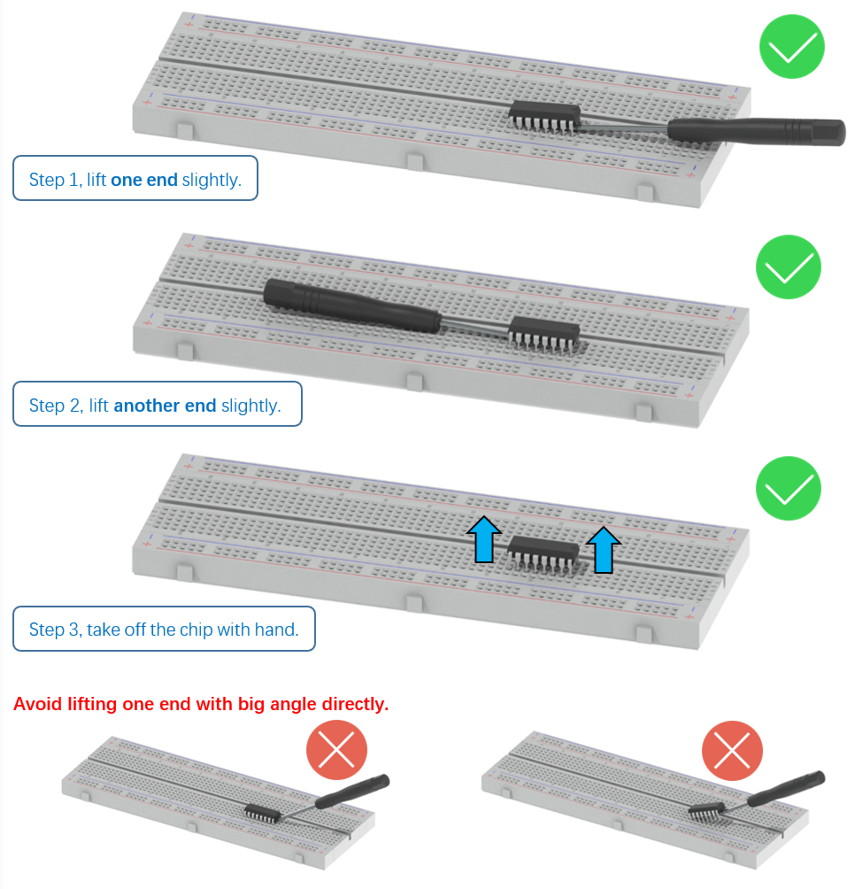

##############################################################################
Welcome
##############################################################################

Thank you for choosing Freenove products!

How to Start
*******************************

When reading this, you should have downloaded the ZIP file for this product.

Unzip it and you will get a folder containing tutorials and related files. Please start with this PDF tutorial.

:combo:`red font-bolder:!` Unzip the ZIP file instead of opening the file in the ZIP file directly.

:combo:`red font-bolder:!` Do not move, delete or rename files in the folder just unzipped.

Get Support
*************************************

Encounter problems? Don't worry! Refer to "TroubleShooting.pdf" or contact us.

When there are packaging damage, quality problems, questions encountering in use, etc., just send us an email. We will reply to you within one working day and provide a solution.

support@freenove.com

Attention
****************************************

Pay attention to safety when using and storing this product:

- This product is not suitable for children under 12 years of age because of small parts and sharp parts.

- Minors should use this product under the supervision and guidance of adults.

- This product contains small and sharp parts. Do not swallow, prick and scratch to avoid injury.

- This product contains conductive parts. Do not hold them to touch power supply and other circuits.

- To avoid personal injury, do not touch parts rotating or moving while working.

- The wrong operation may cause overheat. Do not touch and disconnect the power supply immediately.

- Operate in accordance with the requirements of the tutorial. Fail to do so may damage the parts.

- Store this product in a dry and dark environment. Keep away from children.

- Turn off the power of the circuit before leaving.

About
************************************

Freenove provides open source electronic products and services.

Freenove is committed to helping customers learn programming and electronic knowledge, quickly implement product prototypes, realize their creativity and launch innovative products. Our services include:

- Kits for learning programming and electronics

- Kits compatible with Arduino®, Raspberry Pi®, micro:bit®, ESP32®, etc.

- Kits for robots, smart cars, drones, etc.

- Components, modules and tools

- Design and customization

To learn more about us or get our latest information, please visit our website:

http://www.freenove.com

Copyright
***************************************

All the files provided in the ZIP file are released under Creative Commons Attribution-NonCommercial-ShareAlike 3.0 Unported License. You can find a copy of the license in the ZIP file.

It means you can use these files on your own derived works, in part or completely. But not for commercial use.

Freenove brand and logo are copyright of Freenove Creative Technology Co., Ltd. and cannot be used without written permission.

.. image:: ../_static/imgs/Welcome/welcome00.png
    :align: center

This means you can use these resource in your own derived works, in part or completely but NOT for the intent or purpose of commercial use.

Freenove brand and logo are copyright of Freenove Creative Technology Co., Ltd. and cannot be used without written permission.

.. image:: ../_static/imgs/Welcome/welcome01.png
    :align: center

Other registered trademarks and their owners appearing in this document:

Arduino® is a trademark of Arduino LLC (https://www.arduino.cc/).

Raspberry Pi® is a trademark of Raspberry Pi Foundation (https://www.raspberrypi.org/).

micro:bit® is a trademark of Micro:bit Educational Foundation (https://www.microbit.org/).

ESPRESSIF® and ESP32® are trademarks of ESPRESSIF Systems (Shanghai) Co. Ltd 

(https://www.espressif.com/).

Remove the Chips
*********************************

Some chips and modules are inserted into the breadboard to protect their pins.

You need to remove them from breadboard before use. (There is no need to remove GPIO Extension Board.)

Please find a tool (like a little screw driver) to handle them like below:

